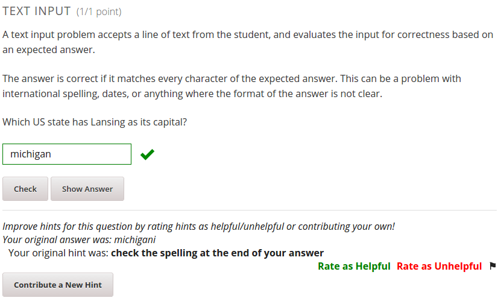

This is the repository for the Crowdsource Hinter XBlock. The Crowdsource Hinter serves to provide students with hints when they incorrectly answer a problem within a course (currently tested for text and numerical input type questions).

This XBlock is still a prototype. 

An example of a student recieving a hint 

An example of after a student corrects their answer

To bring the crowd sourced hinter into a demo course:

First, follow https://github.com/edx/edx-platform/blob/master/docs/en_us/developers/source/xblocks.rst#testing for general xblock creation.
The name of the module to set in the advanced settings tab is "crowdsourcehinter".

After creating a new unit, add the crowdsourcehinter XBlock into a course just like any other XBlock. The name of the crowd sourced hinter may not show up in studio for some unknown reason, but an empty space where its name should be will be clickable (problem to be identified/fixed...).

What It Does:
The two key features of the crowdsource hinter are the abilities to show students hints and to have the students themselves create hints to be shown to future students. 

When a student incorrectly answers a problem, the hinter will look through its database to search for a hint that has been stored for that exact incorrect answer input (i.e. when the database is large enough, two different incorrect answers would not receive the same hint). If hints exist for a student's incorrect answer, this hint is shown to the student. The student then may have the opportunity to input their answer again, which may prompt another hint to be displayed.

After a student re-submits an answer correctly, they can rate hints for their usefulness or contribute a new hint to be used by other students. Rating hints works by upvoting, downvoting, or reporting hints. The new hint that is contributed by a student is specific to the incorrect answer that they make (currently the first incorrect answer will be prompted for contributing new hints).
