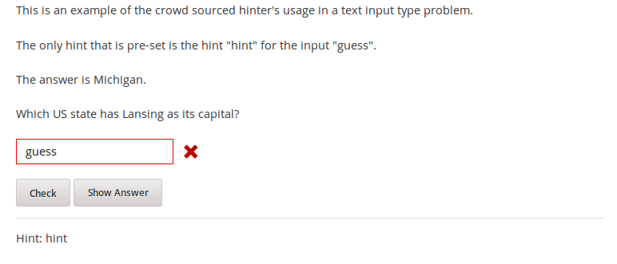

This is the repository for the Crowd Sourced Hinter XBlock. The Crowd Sourced Hinter serves to provide students with hints when they incorrectly answer a problem within a course (currently tested for text and numerical input type questions).

This XBlock is still under construction. To be implemented are methods to properly moderate reported hints (currently a staff member must answer each question to view crude moderation options).

An example of a student recieving a hint 

An example of a hint giving feedback

To bring the crowd sourced hinter into a demo course:

First, follow https://github.com/edx/edx-platform/blob/master/docs/en_us/developers/source/xblocks.rst#testing for general xblock creation.
The name of the module to set in the advanced settings tab is "crowdxblock" (this will likely be changed in the near future to something like "crowd_sourced_hinter").

After creating a new unit, add the crowdsourcedhinter XBlock into a course just like any other XBlock. The name of the crowd sourced hinter may not show up in studio for some unknown reason, but an empty space where its name should be will be clickable (problem to be identified/fixed...).

What It Does:
The two key features of the crowd sourced hinter are the abilities to show students hints and to have the students themselves create hints to be shown to future students. 

When a student incorrectly answers a text input type problem, the crowd sourced hinter will look through its database to search for a hint that has been stored for that exact incorrect answer input (i.e. when the database is large enough, two different incorrect answers would not receive the same hint). If hints exist for a student's incorrect answer, this hint is shown to the student. The student then may have the opportunity to input their answer again, which may prompt another hint to be displayed. 

After a student re-submits an answer correctly, they can rate hints as well as submit new hints. Rating hints works by upvoting, downvoting, or reporting hints. Students can submit new hints for each incorrect answer that has been made, and this hint will be stored only for that specific incorrect answer.
